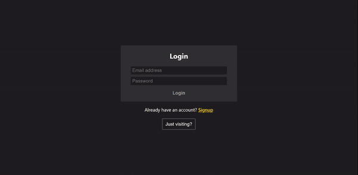

# To Do List

<a href="https://kfig21.github.io/todo_list_react/" target="_blank" rel="noopener noreferrer">View the project here!</a> 👀

<h3>Summary</h3>

This was the 'To-do list" project for <a href="https://www.theodinproject.com/paths/full-stack-javascript/courses/javascript/lessons/todo-list" target="_blank" rel="noopener noreferrer">The Odin Project's</a> JavaScript curriculum. This app was built with React, styled with Sass, and uses Firebase as a backend database. Users can create multiple lists with many tasks that can be edited in realtime thanks to firebase's snapshot feature.

<h3>Features:</h3>

- Adding/deleting tasks & lists
- Set tasks as complete, incomplete & urgent
- Filter tasks by complete, incomplete & urgent
- Update task & list details in realtime.
- Backend storage so users can access their lists on any device
- Responsive design
- 
<h3>Demo GIF</h3>

<h4>Desktop</h4>

<h4>Mobile</h4>

-----------------------------

<h3>Thanks for checking out my project! Any && all feedback is appreciated!</h3>
